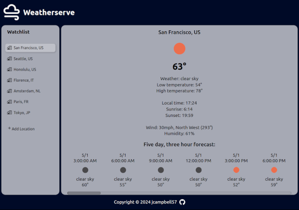
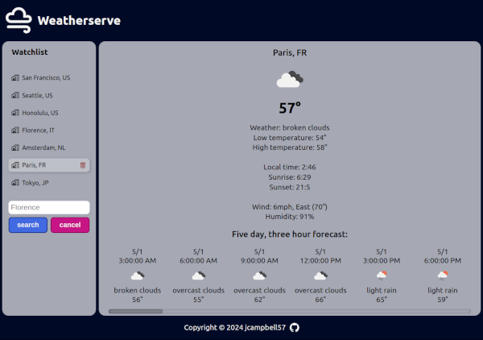

# Weatherserve

## Project info

Input a city to retrieve weather information. The purpose of this project is to practice integration of an API, linter, Prettier and JavaScript compiler.

Project description can be found [here](https://www.theodinproject.com/lessons/javascript-weather-app)

## Live demo

Live demo available [here](https://jcampbell57.github.io/weather-app)

## Table of Contents

* [Features](#features)
* [Technologies utilized](#technologies-utilized)
* [Learning outcomes](#learning-outcomes)
* [Project screenshots](#project-screenshots)
* [Behind the Scenes](#behind-the-scenes)
* [Installation](#installation)

## Features

- Display daily and hourly forecast data for a given location.
- Unique weather symbols for each forecast description.
- Side scrolling five day forecast

## Technologies utilized:

- HTML5
- CSS3
- JavaScript ES6
- Webpack
- JSON
- ESLint
- Prettier
- Babel

## Learning outcomes

This project helped to reinforce the following skills:

- API integration
- Promises & Async/Await functionality
- ESLint integration
- Prettier integration
- Babel integration
- JSON
- serialization
- localStorage integration
- webpack
- JavaScript modules
- DOM manipulation
- CSS styling

## Project screenshots

### Weatherserve:

 

### Add or remove locations:

 

## Behind the scenes

### Improvements

This project could be improved with:

- Responsive design for mobile or tablet use
- Ability to toggle between metric or imperial units.
- Improved styling
- Cleaner code

### Resources

- [This resource](https://gist.github.com/cobyism/4730490) is helpful when deploying to gh-pages after webpack is run.

## Installation

- Clone this repository to your desktop.
- Navigate to the top level of the directory by running `cd weather-app`.
- Run `npm install` to install the required dependencies.  
- Open `dist/index.html` in your browser.
- Run `npm run watch` to update the `dist` folder on save
- Refresh page after saving to see changes
